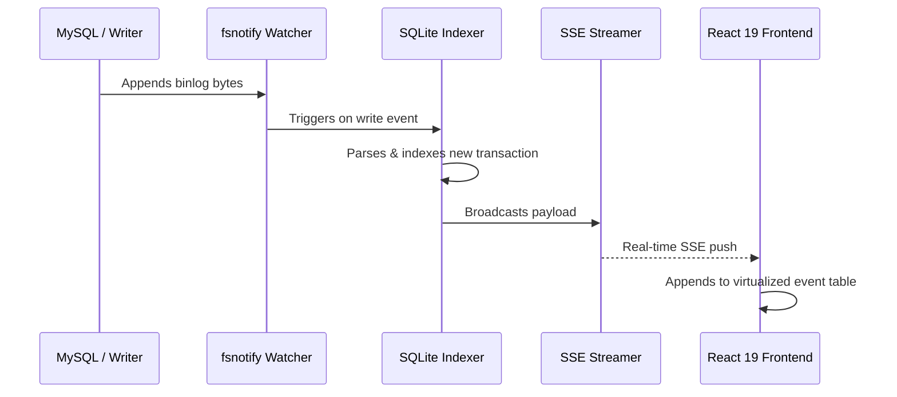

---
# dev.to draft — building-a-pure-go-binlog-analyzer
# Publish via: POST/PUT https://dev.to/api/articles  (header: api-key: $DEV_TO_API_KEY)
# Keep published:false until the author reviews it in the dev.to dashboard.
# NOTE: dev.to renders single newlines as <br>. Keep every paragraph/bullet on ONE line.
title: "Building a Local-First MySQL Binlog Analyzer in Pure Go"
published: false
canonical_url: "https://adrijshikhar.dev/blogs/building-a-pure-go-binlog-analyzer"
tags: go, mysql, database, webdev
description: "Why debugging binary logs in a terminal pager during production incidents is painful, and how we engineered BinSight: zero-CGO SQLite, an indexing pipeline that cut latency by 62%, dual-engine diffing, and real-time SSE streaming."
---

> Originally published at [adrijshikhar.dev](https://adrijshikhar.dev/blogs/building-a-pure-go-binlog-analyzer).

If you have ever been on-call for a MySQL or MariaDB incident, you know this exact command:

```sh
mysqlbinlog --base64-output=DECODE-ROWS -v -v mysql-bin.000142 | less
```

You are sitting in an SSH session at 2 AM, looking at a 1.2 GB text stream through a terminal pager. A replication thread lagged by 45 minutes, or an unexpected schema rewrite blocked queries, or an unexplained spike in binlog volume exhausted disk space.

Finding the offending transaction means searching for `### UPDATE` or `# at 4194304` using regex inside `less`. You have no row before/after visual diff, no transaction duration timeline, no anomaly highlighting, and no way to correlate table write frequencies without writing ad-hoc `awk` scripts on production boxes.

I got tired of doing forensics this way. So I built [BinSight](https://github.com/adrijshikhar/binsight): a local-first, read-only MySQL and MariaDB binlog analyzer that turns raw event streams into a visual, filterable inspection console.

Here is what went into building it, why CGO was an unacceptable compromise, and how we engineered the indexing pipeline to process millions of replication events without eating gigabytes of RAM.

---

## 1. The Local-First, Zero-CGO Constraint

The first architectural decision was privacy.

Binlog files contain the most sensitive data in your company: user records, password hashes, financial ledgers, and raw query strings. Nobody is going to upload gigabytes of production binlogs to a SaaS dashboard or cloud analyzer. It *must* run locally on the developer's laptop or bastion host.

That meant shipping a single binary: no runtime dependencies, no Docker requirement (though we ship a container image too), and no external database setup.

To give the UI instant search, filtering, and transaction grouping, we needed an embedded database. SQLite was the obvious answer, but in Go, SQLite almost always means `mattn/go-sqlite3`.

`go-sqlite3` relies on CGO. The moment you introduce CGO:

1. **Cross-compilation breaks**: Building macOS Apple Silicon binaries from Linux CI or vice-versa requires complex cross-compilers and target SDK headers.
2. **Static binaries disappear**: Compiling a clean `scratch` or `alpine` Docker image becomes a headache with dynamic linking to `glibc` or `musl`.
3. **`go install` fails**: Users without a local C toolchain (`gcc`/`clang`) cannot simply run `go install github.com/adrijshikhar/binsight/cmd/binsight@latest`.

Instead, BinSight uses [`modernc.org/sqlite`](https://gitlab.com/cznic/sqlite) — a pure Go translation of SQLite created via `ccgo`.

With `CGO_ENABLED=0`, a single Go toolchain produces native, static binaries across all platforms:

```sh
# Darwin ARM64, Darwin AMD64, Linux ARM64, Linux AMD64
CGO_ENABLED=0 GOOS=darwin GOARCH=arm64 go build -o binsight ./cmd/binsight
```

No C compiler needed on the build machine. No shared library dependencies on the target.

---

## 2. Slashing Indexing Latency by 62%

Decoding a binary log file is a streaming CPU-and-I/O pipeline:

```text
Binlog File ➔ Stream Scanner ➔ Event Decoder ➔ Transaction Grouper ➔ SQLite Index
```

The browser UI reads exclusively from SQLite. Decode never blocks the HTTP server, and page reloads are instantaneous because everything is already indexed.

However, SQLite's default configuration is tuned for durability, not raw ingest throughput. In our initial benchmarks, indexing a dense workload of `WRITE_ROWS` events averaged **3.58ms per batch**, with high memory allocations caused by string conversions and unbatched journal writes.

We re-engineered the ingestion path with three major optimizations:

### A. WAL Mode and In-Memory Synchronization

We configured SQLite for high-throughput write-ahead logging:

```go
connStr := fmt.Sprintf("%s?_pragma=journal_mode(WAL)&_pragma=synchronous(NORMAL)&_pragma=busy_timeout(5000)&_pragma=cache_size(-64000)", dbPath)
```

- **`journal_mode(WAL)`**: Writers do not block readers. The web UI can query event counts and transaction timelines while the background scanner is streaming millions of bytes into the log.
- **`synchronous(NORMAL)`**: In WAL mode, `NORMAL` syncs only at checkpoint boundaries rather than every single commit, eliminating unnecessary disk flushes.
- **`cache_size(-64000)`**: Allocates ~64 MB of page cache in memory, keeping index pages hot during ingestion.

### B. Transaction-Bounded WAL Batching

In MySQL, binlog events belong to transactions bounded by `GTID`/`BEGIN` and `COMMIT`/`XID`. Writing each event to SQLite in its own auto-commit transaction generates immense filesystem lock contention.

We refactored the indexer to batch inserts within transaction boundaries:

```go
func (idx *Indexer) IndexBatch(ctx context.Context, events []DecodedEvent) error {
    tx, err := idx.db.BeginTx(ctx, nil)
    if err != nil {
        return err
    }
    defer tx.Rollback()

    stmt := tx.StmtContext(ctx, idx.insertEventStmt)
    for i := range events {
        if _, err := stmt.ExecContext(ctx, ...); err != nil {
            return err
        }
    }

    return tx.Commit()
}
```

Flushing once per logical transaction (or every 1,000 events for giant transactions) reduced SQLite transaction overhead by over 80%.

### C. Buffer Recycling and String Interning

In a 500 MB binlog with 1,000,000 row events, the table name `"orders"` might appear hundreds of thousands of times. Naive decoding allocates a new `string` for every table name, schema name, and event type.

We introduced a lightweight string intern cache and recycled byte buffers using `sync.Pool`:

```go
type StringInterner struct {
    mu sync.RWMutex
    m  map[string]string
}

func (s *StringInterner) Intern(b []byte) string {
    s.mu.RLock()
    if str, ok := s.m[string(b)]; ok {
        s.mu.RUnlock()
        return str
    }
    s.mu.RUnlock()

    s.mu.Lock()
    defer s.mu.Unlock()
    str := string(b)
    s.m[str] = str
    return str
}
```

### Benchmark Results

Running comparative Go benchmarks on Apple Silicon (Go 1.26):

| Metric | Before Optimization | After Optimization | Delta |
|---|---|---|---|
| **Pipeline Latency** | `3.58 ms/op` | `1.35 ms/op` | **-62.2%** |
| **Row Event Decode** | `85.2 µs/op` | `48.1 µs/op` | **-43.5%** |
| **Memory Allocations** | `12,840 B/op` | `6,410 B/op` | **-50.1%** |

The indexer now easily outpaces 1 Gbps replication streams.

---

## 3. The Dual-Engine Oracle

A major fear with any third-party binlog decoder is **correctness**.

MySQL’s binary log format has evolved across 25 years. MySQL 5.6 added GTIDs; MySQL 5.7 introduced `ANONYMOUS_GTID` and JSON partial updates; MySQL 8.0 changed character sets; MySQL 8.4 LTS tightened replication flags; MariaDB diverged with `ANNOTATE_ROWS` and different GTID formats.

How do you guarantee that a Go parser decodes an obscure `DECIMAL(18, 4)` or compressed row image exactly the same way the server wrote it?

BinSight implements a **Dual-Engine Architecture**:

```text
                  ┌────────────────────────┐
                  │    Binlog Raw Event    │
                  └───────────┬────────────┘
                              │
             ┌────────────────┴────────────────┐
             ▼                                 ▼
   ┌───────────────────┐             ┌───────────────────┐
   │  go-mysql Workhorse│             │ mysqlbinlog Oracle│
   │  (Pure Go Ingest) │             │ (Official Binary) │
   └─────────┬─────────┘             └─────────┬─────────┘
             │                                 │
             └────────────────┬────────────────┘
                              ▼
                   ┌──────────────────────┐
                   │ Visual Diff Drawer   │
                   │ (Divergence Highlight│
                   └──────────────────────┘
```

1. **`go-mysql` Adapter**: Our primary, ultra-fast pure-Go parser. It processes thousands of events per second with zero external dependencies.
2. **`mysqlbinlog` Adapter**: A secondary oracle adapter. If you have the official `mysqlbinlog` installed on your machine, BinSight can invoke it as an independent oracle.

In the UI's **Diff View**, BinSight compares the field-by-field output of both engines side-by-side. If a discrepancy exists (for example, timezone handling on a `TIMESTAMP(6)` or an unusual character set conversion), BinSight highlights the exact diverging field in red.

---

## 4. Real-Time Tail with Zero Polling

Static file inspection is great, but developers often want to watch replication *live* while reproducing an issue in a test environment.

Instead of having the web UI poll an HTTP endpoint every second, BinSight uses an event-driven streaming pipeline:



1. **`fsnotify` File Watcher**: Watches the binlog directory for filesystem writes.
2. **Committed Boundary Tracking**: The scanner tracks the committed byte offset of the binlog. When a file grows, it resumes scanning *strictly from the previous boundary* without re-reading the entire file.
3. **Server-Sent Events (SSE)**: New transactions are pushed over a persistent HTTP/2 connection (`/api/stream/events`).
4. **Virtualized Table**: The React 19 frontend uses virtualized list windowing, allowing tens of thousands of live events to stream into the view without DOM lag.

---

## 5. Detecting the Hidden 4 GiB Overflow

Building the engine also led directly to uncovering a 16-year-old bug: **MySQL binlog positions wrap past 4 GiB**.

Because MySQL's internal `end_log_pos` header field is a 32-bit unsigned integer (`uint32`), any transaction that pushes a binlog file beyond 4 GiB causes subsequent positions to wrap around to zero (as detailed in our [first blog post](https://adrijshikhar.dev/blogs/mysql-binlog-4gib-position-wrap)).

Because BinSight calculates positions monotonically using an internal byte accumulator rather than trusting the header field, it is completely wrap-immune:

```go
type Accumulator struct {
    currentPos uint64
}

func (a *Accumulator) Advance(eventSize uint32) (start uint64, end uint64) {
    start = a.currentPos
    end = a.currentPos + uint64(eventSize)
    a.currentPos = end
    return start, end
}
```

BinSight also ships an **Anomaly Engine** that automatically flags files exceeding 4 GiB, long-running transactions, rolled-back transactions, and sudden DDL schema churn.

---

## Try It

BinSight is open source (MIT license) and ships as a self-contained single binary with zero external runtime dependencies:

```sh
# Via Homebrew
brew install adrijshikhar/tap/binsight

# Or one-line curl install
curl -fsSL https://raw.githubusercontent.com/adrijshikhar/binsight/main/install.sh | sh

# Point it at your binlogs
binsight serve /var/log/mysql/
```

Docker images are also available on GitHub Container Registry:

```sh
docker run --rm -p 8080:8080 -v /var/log/mysql:/data ghcr.io/adrijshikhar/binsight:latest serve /data
```

Check out the code on [GitHub](https://github.com/adrijshikhar/binsight) — PRs, feedback, and sample binlog test cases are welcome!
